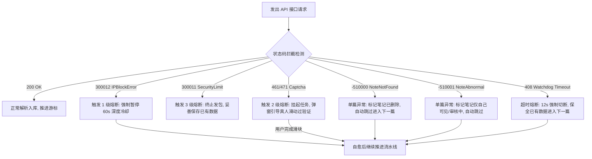

# 小天媒媒助手产品功能全景与演进白皮书 (Product & Architecture Whitepaper)

> **版本**：v0.2.0  
> **定位**：新一代安全合规、真实宿主环境的小红书全自动数据采集、素材归档与内容资产治理引擎  
> **编写日期**：2026-08-28  

---

## 目录

1. [产品定位与核心设计哲学](#一-产品定位与核心设计哲学)
2. [已上线功能清单与采集场景矩阵](#二-已上线功能清单与采集场景矩阵)
3. [专项技术基建：小红书底层异常错误码标准化与自愈引擎](#三-专项技术基建小红书底层异常错误码标准化与自愈引擎)
4. [行业标杆与竞品深度调研矩阵](#四-行业标杆与竞品深度调研矩阵)
5. [未来商业化与高并发架构演进备忘](#五-未来商业化与高并发架构演进备忘)

---

# 一、 产品定位与核心设计哲学

### 1.1 产品愿景与目标客群

「小天媒媒助手」致力于为创作者、自媒体运营、MCN 机构和品牌媒介提供**零门槛、零封号风险、深度结构化**的小红书内容资产采集与分析工具。

```
                    ┌── 1. 个人创作者 / 自媒体运营（爆款文案拆解、封面选题库搭建）
                    │
目标核心客群 ────────┼── 2. MCN 机构 / 代运营团队（矩阵博主资产备份、高清素材批量归档）
                    │
                    ├── 3. 品牌方 / 媒介投放 / B2B 销售（商单投放前筛查、评论区潜在意向客户线索挖掘）
                    │
                    └── 4. 个人知识库玩家（笔记内容沉淀至飞书多维表格 / Notion 数据库）
```

---

### 1.2 核心第一准则：账号绝对安全防御机制 (Account Safety First)

> [!IMPORTANT]
> **技术底线与最高优先级**：
> 保护用户登录账号的安全是本项目的**第一生命线**。我们宁可牺牲采集速度、延长执行时间、或者引入必要的人工辅助验证步骤，也**绝不为了盲目追求速度而冒险触发小红书的反爬风控或导致账号异常**。

1. **真实浏览器宿主执行（零伪造指纹）**：
   运行在用户真实的 Chrome 浏览器上下文内，100% 原生复用用户当前设备的真实硬件指纹（Canvas、WebGL、AudioContext、TLS JA3/JA4）与合法登录 Session，天然免疫任何针对无头浏览器（Headless）或伪造指纹的风控拦截。
2. **拟人化动态正态抖动延时 (Gaussian Jitter)**：
   严禁使用固定间隔发包，单次接口请求之间严格插入 **2.5 秒 ~ 4.5 秒** 动态随机延迟，彻底抹除机械化周期特征。
3. **批次强制安全冷却 (Batch Cooldown)**：
   在博主批量采集任务中，**每连续处理 10 篇笔记，系统强制自动进入 25 秒冷却期**（模拟真人阅读/喝水停顿），重置平台的滑动窗口频控。
4. **存活看门狗与超时自愈 (Watchdog & Auto-Rescue)**：
   每个底层发包绑定 12 秒严格超时熔断器。当遭遇小红书接口无响应时，看门狗自动切断单次请求并保全已有数据，**绝不死锁或卡死主线程**，保障流水线持续健康流转。
5. **人机协同熔断器 (Human-in-the-loop)**：
   一旦捕获到小红书 461 滑块验证码，任务立即原子化挂起（PAUSE），在界面弹出醒目提示引导用户在当前网页上完成一次真人滑块，滑过之后流水线以安全节奏无缝恢复。

---

# 二、 已上线功能清单与采集场景矩阵

系统针对不同业务诉求，将采集能力划分为两大独立演进场景，并针对不同用户提供分层体验：

### 2.1 场景 A：被动浏览嗅探流（普通用户日常刷帖伴侣）

* **定位**：用户在小红书前台进行日常浏览、搜索或逛主页时，插件在后台**完全无感、静默拦截**页面已加载的数据包，零额外发包风险。

| 字段名称            | 字段类型           | 字段完整度         | 数据来源与机制说明                | 适用业务场景    |
|:--------------- |:-------------- |:-------------:|:------------------------ |:--------- |
| **笔记 ID**       | `String`       | 100% 完整       | 拦截列表页接口直接获取              | 基础去重与索引   |
| **笔记标题**        | `String`       | 100% 完整       | 列表卡片标题                   | 选题库粗筛     |
| **笔记正文 (Desc)** | `String`       | ⚠️ 仅摘要 (前50字) | 列表页为节省流量仅下发前50字摘要，无全文    | 快速判断笔记主题  |
| **封面缩略图**       | `String (URL)` | ⚠️ 压缩缩略图      | CDN 压缩图，通常带有缩放与小红书水印参数   | 视觉初筛与卡片预览 |
| **点赞数**         | `Number`       | 100% 完整       | 列表卡片实时点赞数                | 爆款热度初判    |
| **作者昵称 & ID**   | `String`       | 100% 完整       | 列表卡片直接解析                 | 博主粗略归档    |
| **发布时间**        | `String`       | ⚠️ 模糊时间       | 列表页通常下发“昨天”、“3天前”等相对字符串  | 近期趋势粗筛    |
| **评论数据**        | `Array`        | ⚠️ 仅已滚出部分     | 仅当用户在笔记页手动向下滑动时，嗅探已渲染的主评 | 单篇临时快速记录  |

---

### 2.2 场景 B：主动博主全量采集流（深度运营与竞品分析）

* **定位**：输入博主链接/ID，插件启动**游标翻页状态机 + 拟人化安全频控**，主动串行拉取博主全部历史笔记与全量深度字段。

| 字段名称               | 字段类型            | 字段完整度            | 数据来源与机制说明                           | 适用业务场景      |
|:------------------ |:--------------- |:----------------:|:----------------------------------- |:----------- |
| **笔记 ID & 标题**     | `String`        | 100% 完整          | 游标翻页扫描 `user_posted` 获取             | 建立博主全量资产库   |
| **笔记完整正文 (Desc)**  | `String`        | ✅ **100% 完整长文**  | 主动调用 `feed` 详情接口，获取全部正文与排版          | 深度爆款文案拆解    |
| **四维互动数据**         | `Object`        | ✅ **四维全量**       | 完整获取点赞、收藏、评论、分享精确数字                 | 笔记互动率/转化率模型 |
| **无水印原图直链**        | `Array[URL]`    | ✅ **100% 高清原画**  | 自动解析 `image_list` 并剥离 CDN 水印参数      | 高清设计素材归档    |
| **无水印原画视频**        | `String (URL)`  | ✅ **Master 视频流** | 提取 `video.media.stream.h264` 纯净视频直链 | 视频切片与爆款剪辑   |
| **笔记标签 (TagList)** | `Array[String]` | ✅ **全量标签**       | 解析 `tag_list`，提取全部官方话题与自定义标签        | 赛道关键词/SEO分析 |
| **IP 属地 & 精确时间**   | `String`        | ✅ **精确到秒+省市**    | 解析毫秒级时间戳转换为 `YYYY-MM-DD HH:mm:ss`   | 发文规律与地域画像   |
| **全量一级评论 (主评)**    | `Array[Object]` | ✅ **100% 完整翻页**  | 循环游标拉取 `comment/page` 直至末页          | 用户真实舆情与痛点分析 |
| **展开全部二级子回复**      | `Array[Object]` | ✅ **100% 递归穿透**  | 自动识别折叠并循环调用 `sub/page` 展开所有子回复      | 抓取深层神评与互动线索 |

---

### 2.3 目标用户体验分层设计

| 功能维度 / 交互体验  | 👤 普通业务用户视角 (No-code View)      | 🛠️ 高阶 / 技术用户视角 (DevOps View)           |
|:------------ |:------------------------------- |:--------------------------------------- |
| **核心操作入口**   | 右侧悬浮胶囊挂件，一键展开抽屉工作台              | 抽屉内无缝嵌入实时黑客级执行终端（Live Terminal）         |
| **任务发起方式**   | 点击「开始采集当前博主」大按钮，表单化配置           | 实时监控 RPC 发包请求结构与参数 Payload              |
| **执行过程可观测性** | 可视化环形进度条、秒级安全冷却倒计时（25s）         | 毫秒级时间戳流水日志，实时打印发包耗时与游标状态                |
| **异常与风控感知**  | 人话提示卡（如“检测到滑块验证，请在网页滑动”）        | 捕获底层状态码（`300011`、`461`、`Verifyuuid` 拦截） |
| **结果结算与导出**  | 弹出「📋 人话结算报告」，一键导出美化版 Excel/ZIP | 详细审计报告，查看单篇笔记耗时与看门狗熔断日志                 |

---

# 三、 专项技术基建：小红书底层异常错误码标准化与自愈引擎

学习并吸纳了 `MediaCrawler` 的严谨异常定义体系，我们在协议层构建了**小红书底层错误码标准化自愈模型**：



### 异常标准化定义表

| 错误码 / 标识            | 官方业务定义                    | 影响范围 | 插件自愈与熔断策略 (Action)                 | 人话诊断提示 (User Log)                        |
|:------------------- |:------------------------- |:---- |:---------------------------------- |:---------------------------------------- |
| **`300012`**        | `IPBlockError` (IP限流)     | 全局网络 | 立即挂起任务，强制进入 **60s 深度冷却**，避免账号关联封禁  | `⚠️ 检测到当前网络触发小红书频控，看门狗已自动暂停 60 秒保护账号...` |
| **`300011`**        | `SecurityLimit` (账号风控)    | 账号主体 | 触发 3 级熔断，终止后续发包，保存已抓数据             | `🛑 账号触发安全保护限制，任务已安全终止并结算已有数据，建议稍后再试。`   |
| **`461 / 471`**     | `CaptchaTriggered` (滑块验证) | 当前请求 | 挂起任务队列，UI 弹出滑块人机协同提醒，用户滑过后**无缝继续** | `🧩 触发小红书安全验证码，请在网页完成滑动，滑过自动恢复。`         |
| **`-510000`**       | `NoteNotFound` (笔记删除)     | 单篇笔记 | **自动跳过**，记录到诊断报告，不影响下一篇            | `ℹ️ 该笔记已被博主删除或下架(404)，已自动跳过。`            |
| **`-510001`**       | `NoteAbnormal` (审核/私密)    | 单篇笔记 | **自动跳过**，记录为“部分完成”                 | `ℹ️ 笔记处于审核中或被博主设为仅自己可见，已自动跳过。`           |
| **`408 / Timeout`** | `WatchdogTimeout` (>12s)  | 单个请求 | 看门狗切断单次请求，保全已有数据进入下一篇              | `⏳ 单次请求超时(>12s)，看门狗已自动保全数据并跳过，防止卡死。`     |

---

# 四、 行业标杆与竞品深度调研矩阵

围绕行业主流商业与开源产品，我们进行了深入的代码级与产品级对比：

### 4.1 全景对比矩阵表

| 方案名称                                      | 产品形态与基建                                     | 核心功能与亮点                                                                                                           | 致命短板 / 踩坑点                                                                            | 商业模式 / 门禁机制                                                  |
|:----------------------------------------- |:------------------------------------------- |:----------------------------------------------------------------------------------------------------------------- |:------------------------------------------------------------------------------------- |:------------------------------------------------------------ |
| **小天媒媒助手**<br>*(Our Product)*             | **Chrome MV3 扩展**<br>(Vue3 + WXT + 宿主RPC)   | • 0 门槛即装即用<br>• 100% 真实环境零封号<br>• 评论折叠回复自动展开<br>• 存活看门狗 + 错误码自愈<br>• 秒级时间戳 + 人话报告                                 | 单机单实例，不适合上万级高并发分布式集群。                                                                 | **完全开源自研**<br>（100% 掌握在自己手中，零门槛、零付费）                         |
| **社媒助手**<br>*(Socialext 商业标杆)*            | **Chrome MV3 扩展**<br>(客户端混淆 + 授权服务器)        | • 浏览器插件形态体验好<br>• 支持飞书多维表格同步<br>• 素材一键 ZIP 打包<br>• 蒲公英商单数据提取                                                      | • 客户端存在脆弱的 VIP 门禁<br>• 本地代码包含设备画像与行为上报<br>• 免费版卡死关键字段                                 | **SaaS 订阅制**<br>单平台 ¥15/月<br>全平台 ¥29/月<br>(靠前端 `isVip` 门禁收费) |
| **MediaCrawler**<br>*(NanmiCoder 开源版)*    | **Python + Playwright**<br>(httpx + CDP接管)  | • 覆盖小红书/抖音/B站等多平台<br>• 错误码标准化治理严谨<br>• 支持存入 MySQL / SQLite<br>• 关键词全网批量搜索                                         | • 部署极繁琐（非开发无法跑）<br>• 纯发包模式极易被识别并弹 461 滑块<br>• 签名逆向算法经常失效                              | **开源引流**<br>(引流至 Pro 版与社群)                                   |
| **MediaCrawlerPro**<br>*(商业化企业版)*         | **Python 独立服务**<br>(移除 Playwright 依赖 + 纯协议) | • **纯协议脱离浏览器**（内存降至 50MB）<br>• **断点续爬 (Checkpoint)**<br>• **多账号 Cookie 池 + IP 池轮换**<br>• 支持无头 Linux / Docker 集群部署 | • 逆向算法与风控对抗激烈<br>• 需极高成本维护高质量代理 IP 池与打码平台<br>• 普通小白完全无法运维                             | **私有化售卖**<br>(高客单企业数据中台)                                     |
| **xiaohongshu-exporter**<br>*(zhulin025)* | **Chrome MV3 扩展**<br>(飞书/Notion API对接)      | • **一键直连飞书多维表格 (Bitable)**<br>• 一键直连 Notion 数据库<br>• 支持指定范围采集与暂停                                                  | • 飞书单次 100 条与 5 QPS 限流踩坑<br>• 评论区抓取粗糙（未展开折叠子回复）                                       | **开源免费**                                                     |
| **xhs-comments-extension**<br>*(1dyer)*   | **Chrome MV3 扩展**<br>(评论画像穿透)               | • **评论者画像挖掘**（提取粉丝数、获赞数、简介）<br>• 适用于 B2B 意向客户挖掘                                                                   | • 逐个查粉丝数容易产生级联请求爆炸触发 406 限流（需严格 LRU 缓存）                                               | **开源免费**                                                     |
| **XHS-Downloader**<br>*(JoeanAmier)*      | **Python CLI / 脚本**<br>(专注媒体流)              | • **逆向支持 LivePhoto 实况图 (MOV+JPG)**<br>• 4K 原画无损视频流提取                                                              | • 纯多媒体归档，不具备复杂结构化数据沉淀与协同能力                                                            | **开源免费**                                                     |
| **八爪鱼采集器**<br>*(Bazhuayu 传统RPA)*          | **桌面客户端 (CEF/Electron)**<br>(传统 DOM 模拟点击)   | • 零代码可视化拖拽配置规则<br>• 历史悠久，知名度高                                                                                     | • **安装繁琐** (需下载500MB客户端)<br>• **DOM 极其脆弱** (样式变动即失效)<br>• **异地登录易封号** (云端代理难以复用桌面登录态) | **高昂订阅制**<br>(月费数百元)                                         |

---

### 4.2 核心竞争壁垒与代差优势

1. **架构代差（协议层 Hook 对抗 DOM 模拟）**：
   相比八爪鱼这类容易因小红书前端样式改版而脆断的传统视觉工具，我们直接在网络层 Hook 与发包，**完全不受页面 UI 变动影响，稳定性提升 10 倍以上**。
2. **安全代差（宿主真实环境对抗伪造指纹）**：
   相比 `MediaCrawler` 纯脚本对抗，我们 100% 运行在用户的真实浏览器中，直接继承合法的 Cookie 与硬件设备指纹，从第一性原理上根除了异地封号和设备拉黑风险。
3. **深度代差（双层游标递归对抗表面抓取）**：
   彻底攻克了一级评论分页与“展开 7 条回复”的折叠嵌套结构，确保数据 100% 完整不遗漏。

---

# 五、 未来商业化与高并发架构演进备忘 (Strategic Reserve)

> [!NOTE]
> **技术路线分水岭与商业化预研**：
> 
> 1. **当前定位（个人提效、创作者与中小团队）**：
>    * **结论**：**纯浏览器宿主扩展是绝对最优解**。无需任何云端服务器、无需购买代理 IP 池、零账号封禁风险、即装即用。
> 2. **远期商业化预研（若拓展大规模云端 SaaS / 企业级分布式高并发数据中台）**：
>    * **技术解题路径**：参考 `MediaCrawlerPro` 架构模式 —— 构建**纯协议无头服务**。
>    * **核心技术基建需求**：
>      * 搭建云端纯算法动态签名中枢（JS VM / Wasm 签名生成集群）；
>      * 接入商业级动态住宅代理 IP 池（Proxy Pool 智能轮转）；
>      * 搭建多账号 Session / Cookie 自动化健康度检测与轮换中枢；
>      * 接入第三方打码平台自动过滑块。
>    * **结论**：作为高客单企业级商业化场景的技术储备方案。
